# Business carousels

A skill that helps any AI assistant turn an idea, reel, post or article into a clear, good-looking carousel for a real business. It keeps what made the original work, plans the slides with you first, designs every slide as one picture that teaches, and is honest about which tools made what.

**Who it's for:** business owners and marketers making Instagram, LinkedIn or Facebook carousels with Claude, Claude Code, ChatGPT or Codex.

## Start here

| You use | Do this |
| --- | --- |
| Claude Code or Codex | Paste the block in [SETUP-PROMPT.md](SETUP-PROMPT.md) into your agent |
| Claude (web or app) or ChatGPT | Paste [PROMPT.md](PROMPT.md) into a chat and attach your files |
| Anything else | See [QUICKSTART.md](QUICKSTART.md) |

## Starting points

Twenty-three examples, each showing a different way to make a slide teach. Click one for full size. None of them sets your colours, fonts, people, wording or layout. What each one teaches, and what to watch for, is in the [examples guide](skills/business-carousels/references/examples.md); the prompts behind them are in [example prompts](skills/business-carousels/references/example-prompts.md).

**Same brief, two assistants**

The same skill and plumbing brief, run in Claude and in Codex. Different looks, same teaching. Slides, prompts and what each one fixed: [live tests](examples/live-tests/README.md).

<a href="showcase/07-same-brief-two-assistants.png">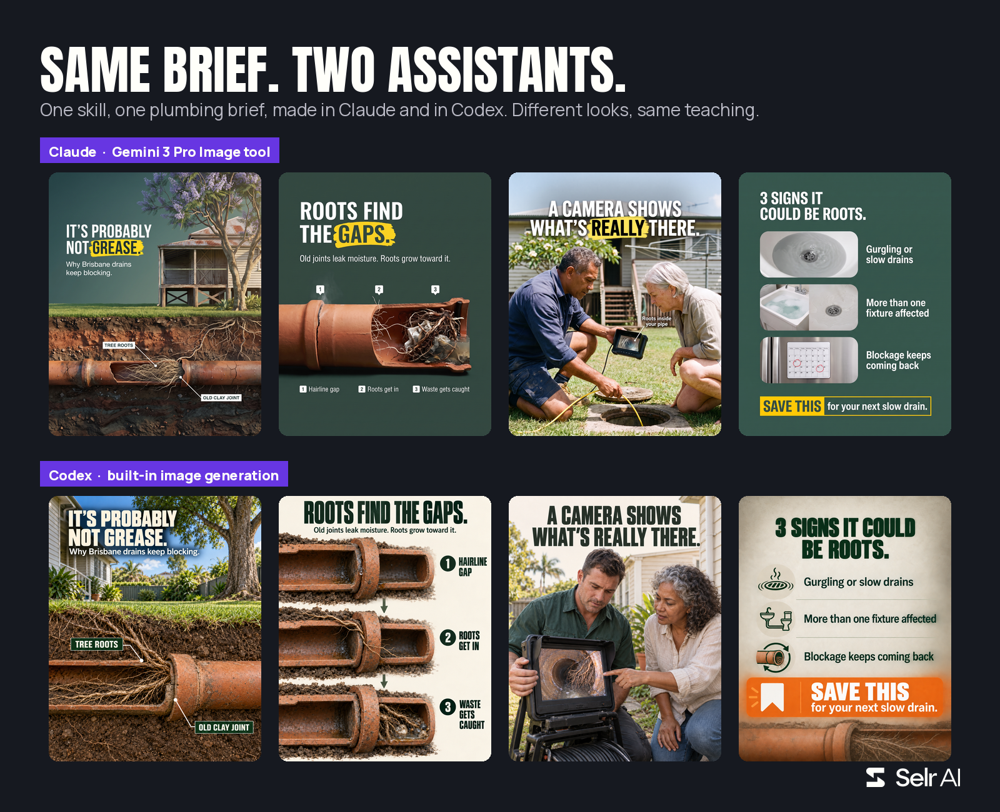</a>

**Trades and products**

<a href="examples/originals/01-plumbing.png">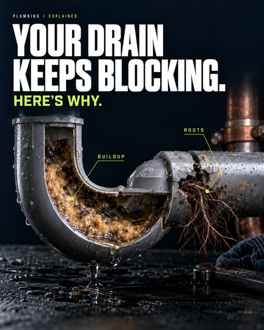</a>
<a href="examples/originals/02-roofing.png">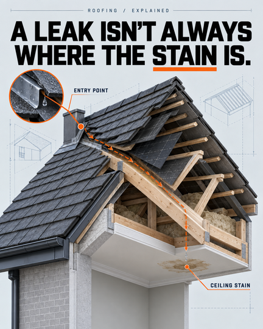</a>
<a href="examples/originals/03-skincare.png">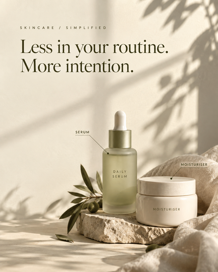</a>
<a href="examples/originals/04-bakery.png">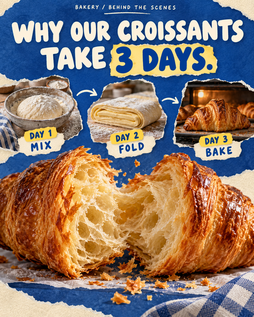</a>
<a href="examples/originals/05-accountant.png">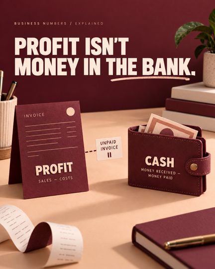</a>

**People in Australian settings**

<a href="examples/originals/11-electrician.png">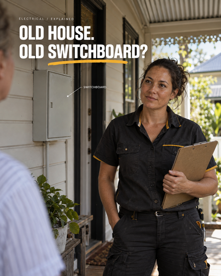</a>
<a href="examples/originals/12-physio.png">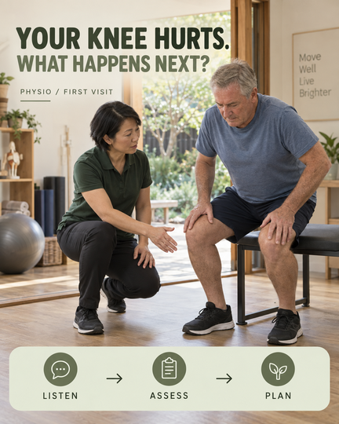</a>
<a href="examples/originals/13-childcare.png">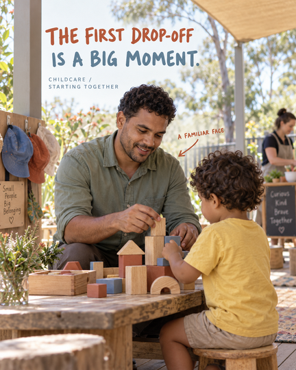</a>
<a href="examples/originals/14-hair-salon.png">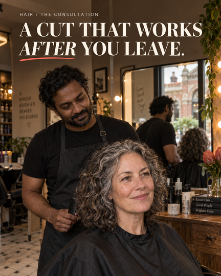</a>
<a href="examples/originals/15-cafe.png">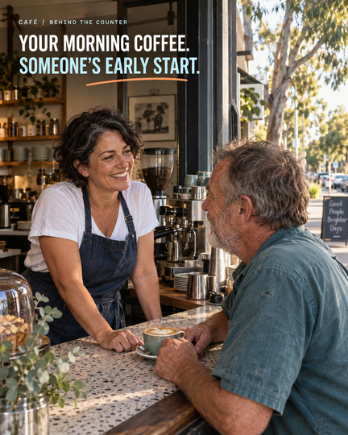</a>

**One scene, three type treatments (final, alternative, trial)**

<a href="examples/originals/21-editorial-restrained-bold-final.png">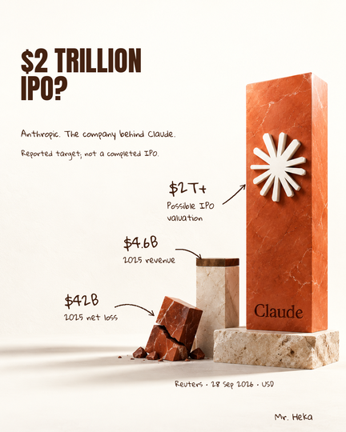</a>
<a href="examples/originals/22-editorial-strong-alternative.png">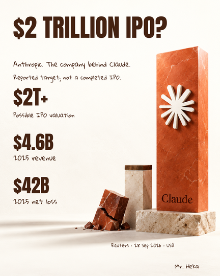</a>
<a href="examples/originals/23-editorial-light-trial.png">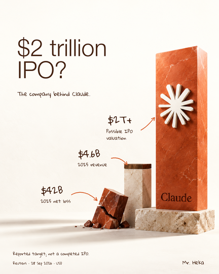</a>

**Interiors get the same care as the cover**

<a href="examples/originals/24-interior-illustrative-comparison.png">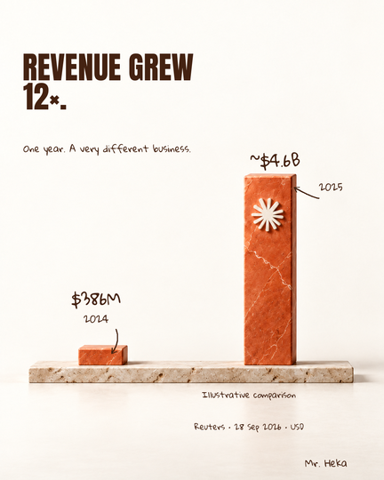</a>
<a href="examples/originals/25-interior-keep-the-qualification.png">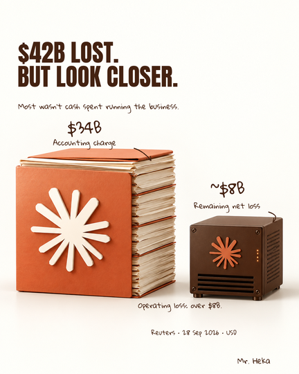</a>

Examples 01 to 15 are fictional demonstrations: invented businesses and generated people, not staff, customers, testimonials or results. Examples 21 to 25 use figures from a Reuters report dated 28 September 2026 and belong to that story only. Downloaded the folder? Open `gallery.html` in a browser for a captioned view.

## What's inside

| Item | What it is |
| --- | --- |
| `skills/business-carousels/` | The skill: `SKILL.md`, ten reference pages and its own copy of every example |
| [SETUP-PROMPT.md](SETUP-PROMPT.md) | Copy-paste install for Claude Code and Codex |
| [PROMPT.md](PROMPT.md) | One copy-paste prompt that works in any chat |
| [QUICKSTART.md](QUICKSTART.md) | Setup notes for Claude, Claude Code, ChatGPT and Codex |
| `examples/` | Full-size originals, phone-size versions and the two live-test carousels |
| `showcase/` | Ready-made panels for sharing: hero, Claude vs Codex, covers, type styles, interiors |
| `gallery.html` | Captioned gallery to open locally |
| [GENERATION-PROMPTS.json](GENERATION-PROMPTS.json) | The prompts behind the examples |
| `fonts/` | Anton and Gloria Hallelujah with their open font licences (examples 21 to 25) |
| [REVIEW.md](REVIEW.md) | What was checked, and what wasn't |
| [SOURCES.md](SOURCES.md) | Official app documentation used for the setup notes |

## Good to know

- The skill doesn't add image generation to your assistant. It uses what your app already has, and says so when it can't make an image.
- It never posts, sends or publishes anything.
- Apps and plans differ. If something doesn't match these notes, ask your assistant to check its available tools and retry.

Made by Selr AI.
